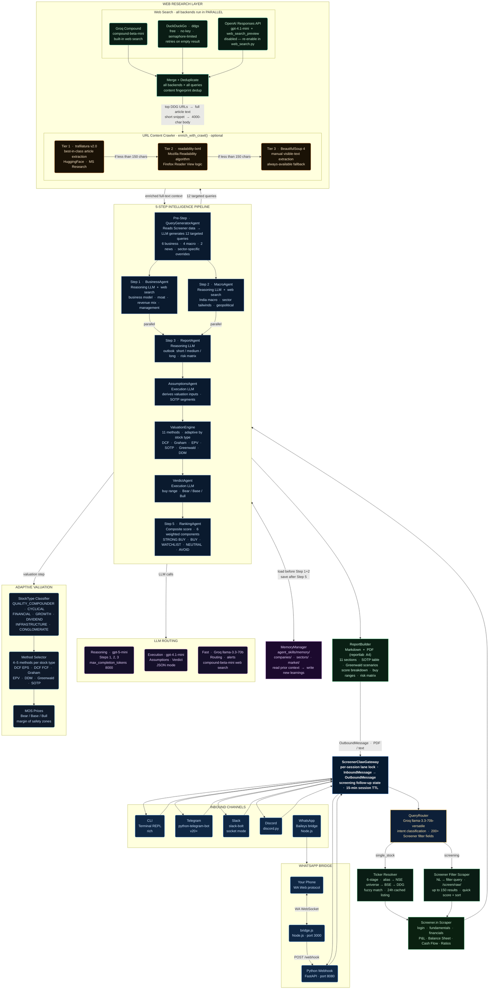

# ScreenerClaw — System Architecture

```mermaid
flowchart TD

    %% ══════════════════════════════════════════════════════════════
    %%  STYLES
    %% ══════════════════════════════════════════════════════════════
    classDef channel    fill:#0f2744,stroke:#4a9eff,color:#cce4ff,rx:4
    classDef gateway    fill:#061a30,stroke:#4a9eff,color:#ffffff,font-weight:bold
    classDef router     fill:#0d1f38,stroke:#f0a500,color:#fde8b0
    classDef pipeline   fill:#0a1a2e,stroke:#5b8dd9,color:#d0e8ff
    classDef subsys     fill:#0a1c14,stroke:#27ae60,color:#c8f0d4
    classDef search     fill:#0a1c14,stroke:#1abc9c,color:#c8f0d4
    classDef crawl      fill:#1a1206,stroke:#e67e22,color:#fde8c8
    classDef llm        fill:#15102a,stroke:#8e44ad,color:#e8d4ff
    classDef val        fill:#0f1a2a,stroke:#2980b9,color:#cce4ff
    classDef memory     fill:#1c0a2e,stroke:#9b59b6,color:#e8d4ff
    classDef external   fill:#0a2010,stroke:#27ae60,color:#c8f0d4
    classDef output     fill:#0a1f14,stroke:#2ecc71,color:#d4ffe8

    %% ══════════════════════════════════════════════════════════════
    %%  INBOUND CHANNELS
    %% ══════════════════════════════════════════════════════════════
    subgraph INBOUND["　　　　　　　INBOUND CHANNELS　　　　　　　"]
        direction LR
        CLI("CLI\nTerminal REPL\nrich"):::channel
        TG("Telegram\npython-telegram-bot\nv20+"):::channel
        SL("Slack\nslack-bolt\nsocket mode"):::channel
        DC("Discord\ndiscord.py"):::channel
        WA("WhatsApp\nBaileys bridge\nNode.js"):::channel
    end

    %% ══════════════════════════════════════════════════════════════
    %%  WHATSAPP BRIDGE  (Node.js sidecar)
    %% ══════════════════════════════════════════════════════════════
    subgraph WA_BRIDGE["　　　　WHATSAPP BRIDGE　　　　"]
        direction TB
        PHONE("Your Phone\nWA Web protocol"):::channel
        BJSN("bridge.js\nNode.js  ·  port 3000"):::channel
        PYWHK("Python Webhook\nFastAPI  ·  port 8080"):::channel
        PHONE <-->|"WA WebSocket"| BJSN
        BJSN  -->|"POST /webhook"| PYWHK
    end

    WA --> WA_BRIDGE

    %% ══════════════════════════════════════════════════════════════
    %%  GATEWAY
    %% ══════════════════════════════════════════════════════════════
    GW["ScreenerClawGateway\nper-session lane lock  ·  InboundMessage → OutboundMessage\nscreening follow-up state  ·  15-min session TTL"]:::gateway

    CLI & TG & SL & DC --> GW
    PYWHK --> GW

    %% ══════════════════════════════════════════════════════════════
    %%  QUERY ROUTER
    %% ══════════════════════════════════════════════════════════════
    QR["QueryRouter\nGroq llama-3.3-70b-versatile\nintent classification  ·  200+ Screener filter fields"]:::router

    GW --> QR

    %% ══════════════════════════════════════════════════════════════
    %%  TWO MAIN PATHS
    %% ══════════════════════════════════════════════════════════════
    QR -->|"single_stock"| TRES["Ticker Resolver\n6-stage  ·  alias → NSE universe → BSE → DDG\nfuzzy match  ·  24h cached listing"]:::subsys
    QR -->|"screening"| FSCR["Screener Filter Scraper\nNL → filter query  ·  /screen/raw/\nup to 150 results  ·  quick score + sort"]:::subsys

    TRES --> SCRAPER["Screener.in Scraper\nlogin  ·  fundamentals  ·  financials\nP&L · Balance Sheet · Cash Flow · Ratios"]:::external
    FSCR --> SCRAPER

    %% ══════════════════════════════════════════════════════════════
    %%  5-STEP PIPELINE
    %% ══════════════════════════════════════════════════════════════
    subgraph PIPELINE["　　　　　　　5-STEP INTELLIGENCE PIPELINE　　　　　　　"]
        direction TB

        PRE["Pre-Step  ·  QueryGeneratorAgent\nReads Screener data  →  LLM generates 12 targeted queries\n6 business  ·  4 macro  ·  2 news  ·  sector-specific overrides"]:::pipeline

        S1["Step 1  ·  BusinessAgent\nReasoning LLM  +  web search\nbusiness model  ·  moat  ·  revenue mix  ·  management"]:::pipeline
        S2["Step 2  ·  MacroAgent\nReasoning LLM  +  web search\nIndia macro  ·  sector tailwinds  ·  geopolitical"]:::pipeline

        S3["Step 3  ·  ReportAgent\nReasoning LLM\noutlook  short / medium / long  ·  risk matrix"]:::pipeline

        S4A["AssumptionsAgent\nExecution LLM\nderives valuation inputs  ·  SOTP segments"]:::pipeline
        S4B["ValuationEngine\n11 methods  ·  adaptive by stock type\nDCF  ·  Graham  ·  EPV  ·  SOTP  ·  Greenwald  ·  DDM"]:::pipeline
        S4C["VerdictAgent\nExecution LLM\nbuy range  ·  Bear / Base / Bull"]:::pipeline

        S5["Step 5  ·  RankingAgent\nComposite score  ·  6 weighted components\nSTRONG BUY  ·  BUY  ·  WATCHLIST  ·  NEUTRAL  ·  AVOID"]:::pipeline

        PRE --> S1 & S2
        S1 & S2 -->|"parallel"| S3
        S3 --> S4A --> S4B --> S4C --> S5
    end

    SCRAPER --> PIPELINE

    %% ══════════════════════════════════════════════════════════════
    %%  WEB RESEARCH  (Search + Crawl)
    %% ══════════════════════════════════════════════════════════════
    subgraph WEB_RESEARCH["　　　　　　　WEB RESEARCH LAYER　　　　　　　"]
        direction TB

        subgraph WEB_SEARCH["Web Search  ·  all backends run in PARALLEL"]
            direction LR
            GRC("Groq Compound\ncompound-beta-mini\nbuilt-in web search"):::search
            DDG("DuckDuckGo  ·  ddgs\nfree  ·  no key  ·  semaphore-limited\nretries on empty result"):::search
            OAI("OpenAI Responses API\ngpt-4.1-mini  +  web_search_preview\ndisabled — re-enable in web_search.py"):::search
        end

        MERGE["Merge + Deduplicate\nall backends  ×  all queries\ncontent fingerprint dedup"]:::search

        GRC & DDG & OAI --> MERGE

        subgraph WEB_CRAWL["URL Content Crawler  ·  enrich_with_crawl()  ·  optional"]
            direction LR
            T1("Tier 1  ·  trafilatura v2.0\nbest-in-class article extraction\nHuggingFace  ·  MS Research"):::crawl
            T2("Tier 2  ·  readability-lxml\nMozilla Readability algorithm\nFirefox Reader View logic"):::crawl
            T3("Tier 3  ·  BeautifulSoup 4\nmanual visible-text extraction\nalways-available fallback"):::crawl
            T1 -->|"if  less than 150 chars"| T2 -->|"if  less than 150 chars"| T3
        end

        MERGE -->|"top DDG URLs  →  full article text\nshort snippet  →  4000-char body"| WEB_CRAWL

    end

    PIPELINE -->|"12 targeted queries"| WEB_RESEARCH
    WEB_RESEARCH -->|"enriched full-text context"| PIPELINE

    %% ══════════════════════════════════════════════════════════════
    %%  LLM ROUTING
    %% ══════════════════════════════════════════════════════════════
    subgraph LLM_ROUTING["　　　LLM ROUTING　　　"]
        direction TB
        LR("Reasoning  ·  gpt-5-mini\nSteps 1, 2, 3\nmax_completion_tokens  8000"):::llm
        LE("Execution  ·  gpt-4.1-mini\nAssumptions  ·  Verdict\nJSON mode"):::llm
        LF("Fast  ·  Groq llama-3.3-70b\nRouting  ·  alerts\ncompound-beta-mini web search"):::llm
    end

    PIPELINE -->|"LLM calls"| LLM_ROUTING

    %% ══════════════════════════════════════════════════════════════
    %%  ADAPTIVE VALUATION
    %% ══════════════════════════════════════════════════════════════
    subgraph VALUATION["　　　　ADAPTIVE VALUATION　　　　"]
        direction TB
        STC("StockType Classifier\nQUALITY_COMPOUNDER  ·  CYCLICAL\nFINANCIAL  ·  GROWTH  ·  DIVIDEND\nINFRASTRUCTURE  ·  CONGLOMERATE"):::val
        MSL("Method Selector\n4–5 methods per stock type\nDCF EPS  ·  DCF FCF  ·  Graham\nEPV  ·  DDM  ·  Greenwald  ·  SOTP"):::val
        MOS("MOS Prices\nBear  /  Base  /  Bull\nmargin of safety zones"):::val
        STC --> MSL --> MOS
    end

    PIPELINE -->|"valuation step"| VALUATION

    %% ══════════════════════════════════════════════════════════════
    %%  SELF-LEARNING MEMORY
    %% ══════════════════════════════════════════════════════════════
    MEM["MemoryManager\nagent_skills/memory/\ncompanies/  ·  sectors/  ·  market/\nread prior context  →  write new learnings"]:::memory

    PIPELINE <-->|"load before Step 1+2\nsave after Step 5"| MEM

    %% ══════════════════════════════════════════════════════════════
    %%  OUTPUT
    %% ══════════════════════════════════════════════════════════════
    RB["ReportBuilder\nMarkdown  +  PDF  (reportlab  A4)\n11 sections  ·  SOTP table  ·  Greenwald scenarios\nscore breakdown  ·  buy ranges  ·  risk matrix"]:::output

    PIPELINE --> RB
    RB -->|"OutboundMessage  ·  PDF / text"| GW
    GW --> CLI & TG & SL & DC & PYWHK
```
