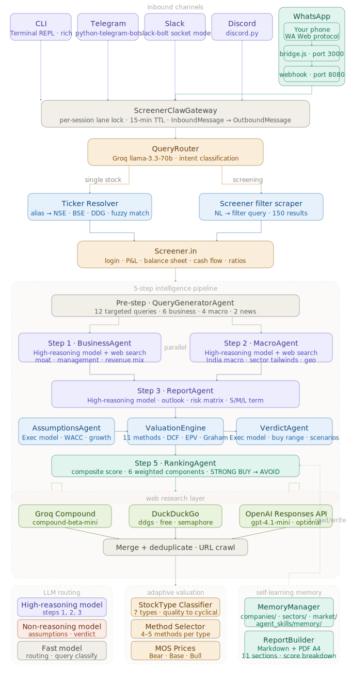

# ScreenerClaw
### AI-Native Indian Stock Intelligence Platform

ScreenerClaw is a multi-agent AI platform for Indian equity research. It runs a 5-step intelligence pipeline (business analysis, macro analysis, report generation, adaptive valuation, composite scoring) and delivers results through multiple channels: CLI, Telegram, Slack, Discord, and WhatsApp.

Agents are brutally honest — designed to protect capital first, generate returns second. No promotional language. No vague bullishness.

The platform is **self-improving**: every analysis writes learnings (moat assessments, sector observations, buy ranges) to persistent memory files. Future analyses for the same company or sector load that prior context automatically.

---
## Architecture




### LLM Routing

| Task Type | Provider | Model |
|-----------|----------|-------|
| Reasoning (Steps 1–3) | OpenAI | `gpt-5-mini` |
| Execution (assumptions, verdicts) | OpenAI | `gpt-4.1-mini` |
| Fast (routing, alerts) | Groq | `llama-3.3-70b-versatile` |

> `gpt-5-mini` is a reasoning model — `max_completion_tokens` covers thinking + output tokens, keep it high (6000–8000). `json_mode` is not applied for reasoning models.

### Stock Universe Cache

At startup, ScreenerClaw downloads the complete NSE and BSE equity listings and saves them locally:

| File | Source | Contents |
|------|--------|----------|
| `data/nse_stocks.json` | NSE `EQUITY_L.csv` | ~2000+ EQ-series stocks: symbol, name, ISIN |
| `data/bse_stocks.json` | BSE equity API | BSE scrip codes, names, ISIN (best-effort) |

Cache refreshes automatically every 24 hours. Downloads run in the background at startup — does not block bot or API startup.

**Why this matters:** Without the universe cache, the LLM query router sometimes abbreviates company names (e.g. "arrowgreentech" → "AGT"). The universe search catches this by fuzzy-matching the full company name against all NSE listings and returning the correct symbol (e.g. `ARROWGREEN`).

**Matching strategy (in priority order):**
1. Exact NSE symbol match (`HDFCBANK` → `HDFCBANK`)
2. Space-collapsed exact match (`arrowgreentech` == `arrow greentech` → `ARROWGREEN`)
3. Normalized exact match
4. All query words found in company name (`tata consultancy` → `TCS`)
5. Name starts with query prefix
6. difflib fuzzy match (≥ 0.72 ratio, query ≥ 6 chars)

Short LLM-guessed abbreviations like `AGT` or `RELIND` that don't hit threshold fall through to Screener.in search automatically.

---

### Web Search — Smart Query Generation

Web research uses a **two-phase approach** instead of hardcoded templates.

#### Phase 1 — Query Generation

Before any web search runs, `QueryGeneratorAgent` reads the Screener.in data and uses the execution LLM to generate **factual, company-specific search queries**.

Runs **once per stock**. Output shared by `BusinessAgent` (Step 1) and `MacroAgent` (Step 2).

| Query Set | Count | What it searches for |
|-----------|-------|----------------------|
| `business_queries` | 6 | Products & revenue mix, competitor market share, promoter/SEBI facts, customer/contract facts, raw material prices, one sector-specific mandatory query |
| `macro_queries` | 4 | Government policy, input cost prices, end-market demand, global trade/import competition — all sector-specific |
| `news_queries` | 2 | Recent quarterly results, analyst downgrades |

**Sector-specific mandatory query (Query 6):**
| Sector flag | What gets searched |
|-------------|-------------------|
| Pharma | Drug name + patent expiry + ANDA + FDA approval year |
| IT/Tech | Client attrition + deal wins + H1B visa + offshore delivery |
| Chemicals | Chemical name + China anti-dumping duty + India 2024 |
| FMCG | Brand name + Nielsen market share + retail distribution |
| Export-heavy | Export USD/EUR + buyer country + FX receivables |

If the LLM call fails → falls back to the old hardcoded templates automatically.

**Core query rule — GOOD vs BAD:**

The prompt explicitly teaches the LLM to generate **factual keyword queries** (specific nouns: product names, peer names, raw material names, regulator names, fiscal years) — not analytical meta-queries. It shows concrete examples using the actual company name:

```
BAD — returns nothing useful:
  "Arrow Greentech SWOT analysis vulnerabilities"
  "Arrow Greentech structural risks red flags"
  "India Chemicals sector macro headwinds tailwinds"

GOOD — returns real articles and data:
  "Arrow Greentech PVC compound masterbatch revenue FY2024 annual report"
  "Arrow Greentech vs Plastiblends India plastic additives market share 2024"
  "Arrow Greentech promoter SEBI pledge shareholding change 2024"
  "Arrow Greentech PVC compound China anti-dumping duty India 2024"
  "naphtha ethylene price India 2025 petrochemical import Arrow Greentech"
  "Arrow Greentech Q3 FY2025 earnings results concall management"
```

#### Phase 2 — Web Search Execution

Generated queries run in parallel across all available backends:

| Backend | Requires | Concurrency | Notes |
|---------|----------|-------------|-------|
| **DuckDuckGo** (`ddgs`) | Nothing | Max 2 concurrent (semaphore) | Always active; retries once on empty result |
| **Groq Compound** (`compound-beta-mini`) | `GROQ_API_KEY` | Unlimited | Built-in web search, fails gracefully |
| **OpenAI Responses API** | `OPENAI_API_KEY` | — | You can enable this by setting `OPENAI_API_KEY` |

**DuckDuckGo rate-limit protection:** A semaphore limits DDG to 2 concurrent requests. When 6 queries run at once, the remaining 4 queue and run as slots free. Each query retries once (with a 1s delay) if DDG returns an empty result. This prevents the silent empty-results failure that caused downstream LLM report generation to fail.

Results from all backends and all queries are merged, deduplicated, and passed to the analysis LLMs as search context.

#### Phase 2.5 — URL Content Enrichment (optional)

After search, agents can call `enrich_with_crawl(results, max_urls=3)` to fetch the **full article text** from the top DDG URLs. This turns the short DDG snippet (~200 chars) into the complete page body (~4000 chars) — much richer context for the LLM.

**Stack — server-safe, zero browser binaries, pure pip install:**

| Tier | Library | Role |
|------|---------|------|
| 1 | **trafilatura** v2.0 | Best-in-class article extraction; strips ads/nav/footers precisely. Used by HuggingFace & Microsoft Research for web corpus building. |
| 2 | **readability-lxml** | Mozilla Readability algorithm — the same logic Firefox Reader View uses. Good fallback for layout-heavy pages. |
| 3 | **BeautifulSoup 4** | Manual visible-text extraction. Already a core dependency; always available as final fallback. |

All three extractors run against the **same single httpx GET request** — no duplicate network calls. If tier 1 extracts enough text (≥ 150 chars), tiers 2 and 3 are skipped.

Groq results (no URL) are passed through unchanged. Only DuckDuckGo results with real HTTP URLs are crawled.

```python
# Example usage in an agent
results = await search_client.search_many(queries)
enriched = await search_client.enrich_with_crawl(results, max_urls=3)
context  = search_client.format_results_for_llm(enriched)
```

### Valuation Methods (9)

Adaptive by stock type — cyclicals get Graham Formula + DCF, compounders get DCF + EPV + Greenwald, dividend stocks get DDM, conglomerates get SOTP:

`dcf_eps` · `dcf_fcf` · `graham_formula` · `pe_based` · `epv` · `ddm` · `reverse_dcf` · `greenwald_growth` · **`sotp`** (conglomerates only)

**Stock types:** QUALITY_COMPOUNDER · CYCLICAL · FINANCIAL · INFRASTRUCTURE · REAL_ASSET · GROWTH · DIVIDEND_YIELD · **CONGLOMERATE**

#### SOTP Valuation (Method 13 — Conglomerates only)

Triggered automatically for companies like Reliance, Tata Motors, M&M, Bajaj Finserv, ITC, Adani Enterprises:

- **Per-segment EV** = Segment EBITDA × Industry multiple (telecom 13×, retail 28×, O2C 7.5×, renewable 12×, IT 14×...)
- **Financial segments** = Book value × 2.0× P/B
- **Loss-making segments** = Revenue × 0.5×
- **HoldCo discount** = 15% applied on total EV
- **Equity value** = Post-discount EV − Net Debt
- Bear / Base / Bull = −15% / Base / +15%

The LLM `AssumptionsAgent` populates `sotp_segments` from segment-level EBITDA estimates for any CONGLOMERATE stock type. PDF report shows a full segment breakdown table + bridge from gross EV to per-share equity value.

#### Greenwald EPV + Growth Valuation (Method 12)

Always computed when ROCE + Book Value data is available:
- **EPV (no-growth)** = Latest EPS (TTM) / R  (at R = 10% and R = 12%)
- **Growth PV** = Capital × (ROC − G) / (R − G)  for G = 4%, 6%, 8%, 10%
- **ROC > R** → growth creates value · **ROC < R** → EPV is the ceiling (value trap)

### Scoring

| Score | Verdict |
|-------|---------|
| 75+ | STRONG BUY |
| 60–74 | BUY |
| 50–59 | WATCHLIST |
| 40–49 | NEUTRAL |
| <40 | AVOID |

**Component weights (capital-safety focused):**

| Component | Weight |
|-----------|--------|
| Valuation | **30%** |
| Business Quality | 20% |
| Growth (Forward) | 20% |
| Growth (Past) | 10% |
| Financial Health | 10% |
| Business Outlook | 10% |

---

## Screening

ScreenerClaw translates natural language into Screener.in filter queries and fetches live results directly from `screener.in/screen/raw/`.

### How It Works

```
User: "Find cheap high ROCE stocks"
           ↓
QueryRouter (LLM) → "Return on capital employed > 22 AND Price to Earning < 15 AND Market Capitalization > 500"
           ↓
ScreenerFilterScraper → GET /screen/raw/?query=...&limit=50&page=1,2,3
           ↓
HTML parsed → up to 150 results (3 pages × 50)
           ↓
Quick scoring (ROCE, ROE, D/E, growth) → sorted by score
           ↓
Formatted table sent to channel

User: "5" or "Coal India" or "COALINDIA"
           ↓
Session state match → Full 5-step deep analysis + PDF
```

### Interactive Flow

After a screening result, **the bot remembers the results for 15 minutes**. The user can select any stock for full deep analysis:

```
User:  find high ROCE low PE stocks
Bot:   [table of 20 results]
       Reply with a number (1–20) or company name for full analysis

User:  17          ← or "Coal India" or "COALINDIA"
Bot:   Running deep analysis on Coal India (COALINDIA)...
       [full PDF report sent]
```

### Supported Filters (~200 fields)

All Screener.in ratio fields are available. Common categories:

| Category | Example Fields |
|----------|---------------|
| Profitability | `Return on capital employed`, `Return on equity`, `OPM`, `NPM` |
| Valuation | `Price to Earning`, `Price to book value`, `EV/EBITDA`, `PEG Ratio`, `Graham Number` |
| Growth | `Sales growth 5Years`, `Profit growth 5Years`, `EPS growth 5Years` |
| Debt / Safety | `Debt to equity`, `Current ratio`, `Interest Coverage Ratio`, `Free cash flow last year` |
| Dividends | `Dividend yield`, `Average 5years dividend` |
| Ownership | `Promoter holding`, `Pledged percentage`, `FII holding`, `DII holding` |
| Size | `Market Capitalization` (Cr) — Smallcap < 5000 · Midcap 5000–20000 · Largecap > 20000 |
| Momentum | `Return over 1year`, `Return over 3months`, `DMA 50`, `DMA 200`, `RSI` |
| Efficiency | `Debtor days`, `Working Capital Days`, `Cash Conversion Cycle`, `Piotroski score` |
| Cash Flow | `Cash from operations last year`, `Free cash flow 3years`, `Free cash flow 5years` |

Full list in `backend/screener/screener_filters.py` (`ALL_FILTERS` — 302 fields).

### Built-in Query Templates

8 ready-made templates in `QUERY_TEMPLATES`:

| Template | Query |
|----------|-------|
| `quality_compounders` | ROCE > 20 + Sales growth 5Y > 15% + Profit growth 5Y > 15% + D/E < 0.5 |
| `value_picks` | PE < 15 + ROCE > 15 + MCap > 500 |
| `high_roce_low_debt` | ROCE > 25 + D/E < 0.3 |
| `dividend_aristocrats` | Div yield > 3% + ROCE > 15 + Profit growth 5Y > 10% |
| `momentum_quality` | Return 1Y > 20% + ROCE > 20 + Sales growth 3Y > 15% |
| `hidden_gems` | MCap 500–5000 + ROCE > 20 + Profit growth 5Y > 20% + D/E < 0.5 |
| `debt_free` | D/E < 0.1 + ROCE > 15 + MCap > 500 |
| `cash_rich` | FCF > 0 + CFO > 0 + ROCE > 15 |

### Screening NL Examples

```
Find cheap high ROCE stocks
High dividend yield PSU stocks
Debt free compounders with strong growth
Undervalued PEG < 1 quality companies
Promoter buying stocks with ROCE > 20
Hidden gems smallcap high growth
High Piotroski score value picks
Net cash companies with strong ROCE
Strong momentum high quality midcaps
Low pledge promoter holding > 50
```

---

## Self-Learning Architecture

Inspired by [OpenClaw](https://github.com/openclaw/openclaw)'s file-based memory system, ScreenerClaw agents learn and improve with every analysis.

### Three-Layer Memory

```
agent_skills/
├── SOUL.md           ← Core identity, values, non-negotiable rules (always loaded)
├── AGENTS.md         ← Operational guidelines for all agents (always loaded)
├── MEMORY.md         ← Hot memory: grows after every analysis (always loaded)
├── business_agent/
│   └── SKILL.md      ← Business agent system prompt + instructions (editable)
├── macro_agent/
│   └── SKILL.md      ← Macro agent system prompt + instructions (editable)
├── report_agent/
│   └── SKILL.md      ← Report agent system prompt + instructions (editable)
├── query_generator/
│   └── SKILL.md      ← Query generator system prompt + sector rules (editable)
├── verdict_agent/
│   └── SKILL.md      ← Verdict/buy-range agent instructions (editable)
├── valuation/
│   └── SKILL.md      ← All 9 valuation methods + India parameters (reference)
└── memory/
    ├── sectors/       ← Per-sector learnings (e.g. pharma.md, it.md)
    ├── companies/     ← Per-company notes (e.g. TCS.md, INFY.md)
    └── market/
        └── observations.md  ← Market cycle observations
```

### How It Works

**Layer 1 — Skill Files (prompt configuration)**
Every agent loads its system prompt from its `SKILL.md` at runtime. Edit the file to change agent behaviour — no code change, no restart.

**Layer 2 — Memory Write (after every analysis)**
`MemoryManager.extract_and_save_learnings()` automatically appends:
- Company file (`memory/companies/TCS.md`) — one-line verdict, moat assessment, composite score, buy range
- Sector file (`memory/sectors/information_technology.md`) — macro verdict, headwinds, tailwinds

**Layer 3 — Memory Read (before next analysis)**
Prior context loads into agents before Steps 1+2. The agent builds on past observations instead of starting cold.

### Learning Cycle

```
Analysis request
       ↓
Read relevant memory (sector + company files)
       ↓
QueryGeneratorAgent — LLM reads Screener data + memory → generates
  6 targeted business queries + 4 sector-specific macro queries + 2 news queries
       ↓
Steps 1+2 run in parallel using generated queries (not hardcoded templates)
       ↓
Steps 3-5 complete (report, valuation, scoring, verdict)
       ↓
Pipeline completes → extract_and_save_learnings()
       ↓
Sector .md + Company .md updated with new observations
       ↓
Next analysis: memory loaded → better queries → deeper research
```

---

## Installation

### Prerequisites
- Python 3.11+
- [uv](https://docs.astral.sh/uv/) (fast package manager)
- Node.js >= 18 (only for WhatsApp channel)

### Setup

```bash
git clone https://github.com/you/screener-claw
cd screener_agent

# Create .venv inside project (uv)
uv venv .venv

# Install all dependencies and register the CLI
uv pip install -e .

# Copy and configure environment
cp .env.example .env
# Edit .env with your API keys
```

> **Important:** Always use `uv pip install`, never `pip install`. Bare pip installs to the system/Anaconda environment, not the project `.venv`.

The `uv pip install -e .` step registers the `screenerclaw` command inside `.venv`. After that, all bot and API operations go through the `screenerclaw` CLI — no need to call `python` directly.

---

## Configuration (`.env`)

```env
# ── LLM Providers ─────────────────────────────────────────────────────────────
OPENAI_API_KEY=sk-...
GROQ_API_KEY=gsk_...
ANTHROPIC_API_KEY=sk-ant-...    # optional

# ── LLM Routing ───────────────────────────────────────────────────────────────
REASONING_PROVIDER=openai
REASONING_MODEL=gpt-5-mini       # deep analysis, valuation, reports

EXECUTION_PROVIDER=openai
EXECUTION_MODEL=gpt-4.1-mini     # data fetch, classification

FAST_PROVIDER=groq
FAST_MODEL=llama-3.3-70b-versatile   # routing, alerts

# ── Screener.in ───────────────────────────────────────────────────────────────
SCREENER_USERNAME=your@email.com
SCREENER_PASSWORD=yourpassword

# ── Channels (add only the ones you want) ─────────────────────────────────────
TELEGRAM_BOT_TOKEN=         # from @BotFather
SLACK_BOT_TOKEN=xoxb-...    # from Slack app settings
SLACK_SIGNING_SECRET=...
SLACK_APP_TOKEN=xapp-...    # for socket mode
DISCORD_BOT_TOKEN=          # from Discord developer portal

# ── WhatsApp (optional overrides) ─────────────────────────────────────────────
WHATSAPP_BRIDGE_PORT=3000     # Node.js Baileys bridge port (default: 3000)
WHATSAPP_WEBHOOK_PORT=8080    # Python webhook receiver port (default: 8080)
```

---

## Running

### API Server (FastAPI)

```bash
screenerclaw api
# OR with overrides
screenerclaw api --port 8080 --reload
```

Endpoints:
- `POST /api/analyze` — main analysis endpoint
- `GET  /api/health` — health check
- `GET  /api/llm/providers` — list available LLM providers + routing config
- `POST /api/llm/test` — test an LLM provider

### Bot Channels

```bash
# CLI (interactive terminal REPL — default)
screenerclaw run

# Telegram bot
screenerclaw run --channel telegram

# Slack bot (socket mode)
screenerclaw run --channel slack

# Discord bot
screenerclaw run --channel discord

# WhatsApp (QR code scan on first run)
screenerclaw run --channel whatsapp

# All configured channels at once
screenerclaw run --channel all
```

---

## Usage Examples

### Single Stock Analysis

Any natural language query works. Accepts NSE symbol, BSE code, company name, or partial/misspelled name:

```
# NSE symbol
Analyse TCS
Analyse HDFCBANK

# Company name
Analyse Reliance Industries
Check Tata Consultancy Services
Tell me about Infosys

# BSE code
Analyse 532540

# Misspellings / casual
Infossys analysis
Check Relaince
What about HDFC bank?

# Less-known / mid/small-cap (resolved via NSE universe cache)
Analyse Arrowgreentech
Analyse Manyavar
Check Delhivery
What about Latent View

# Natural language
What is the intrinsic value of Infosys?
Should I buy Maruti Suzuki?
```

**Smart ticker resolution order:**
1. Known alias lookup (~80 blue-chips with name/misspelling variants)
2. **Local NSE + BSE universe search** — full listing downloaded at startup, cached 24h
3. BSE 6-digit code → Screener.in search
4. Verified direct symbol — only accepted if confirmed present in NSE universe
5. Screener.in autocomplete API search
6. DuckDuckGo fallback (extracts `NSE: TICKER` from search results)

> **Why step 2 matters:** The LLM query router sometimes abbreviates unfamiliar company names (e.g. "arrowgreentech" → "AGT"). The local universe search catches this by fuzzy-matching the full company name against the complete NSE listing, returning the correct symbol (`ARROWGREEN`). Without this, AGT would be sent to Screener.in and either find the wrong company or fail silently.

### Screening

```
Find cheap high ROCE stocks
High dividend PSU stocks
Debt free compounders with 15%+ growth
Undervalued PEG below 1
Promoter buying quality stocks
Hidden gems smallcap
High Piotroski score value picks
Strong momentum quality midcaps
```

After results appear, type a number or company name to run full deep analysis.

### API (curl)

```bash
# Single stock analysis
curl -X POST http://localhost:8000/api/analyze \
  -H "Content-Type: application/json" \
  -d '{"query": "Analyse Reliance Industries"}'

# Screening
curl -X POST http://localhost:8000/api/analyze \
  -H "Content-Type: application/json" \
  -d '{"query": "Find undervalued pharma midcaps"}'

# Override LLM for a request
curl -X POST http://localhost:8000/api/analyze \
  -H "Content-Type: application/json" \
  -d '{"query": "Analyse HDFC Bank", "provider": "anthropic", "model": "claude-sonnet-4-6"}'
```

---

## PDF Reports

Single-stock analysis generates a professional A4 PDF sent as a document:

| Channel | Single Stock | Screening |
|---------|-------------|-----------|
| WhatsApp | PDF document | Text table |
| Telegram | PDF document | Text table |
| Discord | PDF file | Text table |
| Slack | Text (PDF requires file scope) | Text table |
| CLI | Markdown in terminal | Text table |

**PDF section order:**
1. Key Metrics + Composite Score + Valuation Zone
2. Business Profile (model, moat, segments, management)
3. Business Outlook (short / medium / long term)
4. India Macro & Geopolitical Impact
5. Valuation Summary (all methods table + MOS prices)
6. **SOTP Breakdown** (conglomerates only — segment table + bridge to per-share equity value)
7. Greenwald Detailed Analysis (EPV + Growth scenarios, non-conglomerates)
8. Score Breakdown
9. Risk Matrix
10. Buy Ranges (tiered: Strong Buy / Accumulate / Watch / Avoid)
11. Screener.in data link

---

## Project Structure

```
screener_agent/
├── .venv/                          # uv virtual environment (local)
├── agent_skills/                   # Self-learning skills & memory (OpenClaw-style)
│   ├── SOUL.md                     # Core identity, values, non-negotiable rules
│   ├── AGENTS.md                   # Operational guidelines for all agents
│   ├── MEMORY.md                   # Hot memory — grows after every analysis
│   ├── business_agent/SKILL.md     # Business agent system prompt (editable)
│   ├── macro_agent/SKILL.md        # Macro agent system prompt (editable)
│   ├── report_agent/SKILL.md       # Report agent system prompt (editable)
│   ├── query_generator/SKILL.md    # Query generator rules + sector overrides (editable)
│   ├── verdict_agent/SKILL.md      # Verdict agent instructions (editable)
│   ├── valuation/SKILL.md          # All 9 valuation methods + India params
│   └── memory/
│       ├── sectors/                # Per-sector learnings (auto-written)
│       ├── companies/              # Per-company notes (auto-written)
│       └── market/observations.md  # Market cycle observations
├── backend/
│   ├── agents/
│   │   ├── query_generator.py      # Pre-step: LLM generates company-specific search queries
│   │   ├── business_agent.py       # Step 1: uses generated queries, loads prompt from SKILL.md
│   │   ├── macro_agent.py          # Step 2: uses generated queries, loads prompt from SKILL.md
│   │   ├── report_agent.py         # Step 3: loads prompt from SKILL.md
│   │   ├── assumptions_agent.py    # Step 4: derives valuation assumptions + SOTP segments
│   │   ├── verdict_agent.py        # Buy ranges (price_from / price_to keys)
│   │   ├── ranking_agent.py        # Step 5: composite scoring
│   │   └── router.py               # Query intent routing (200+ Screener filters)
│   ├── channels/
│   │   ├── base.py                 # InboundMessage, OutboundMessage, BaseChannel
│   │   ├── cli_channel.py          # Rich terminal REPL
│   │   ├── telegram_channel.py     # python-telegram-bot v20+ (PDF + group mention)
│   │   ├── slack_channel.py        # slack-bolt (DM + app_mention only)
│   │   ├── discord_channel.py      # discord.py (PDF + DM/mention only)
│   │   └── whatsapp_channel.py     # Baileys bridge (PDF + Bad MAC auto-recovery)
│   ├── data/web_search.py          # DuckDuckGo + Groq (OpenAI disabled) + enrich_with_crawl()
│   ├── data/web_crawl.py           # URL content fetcher: trafilatura → readability-lxml → BS4
│   ├── scoring/engine.py           # Quick scoring for screening mode
│   ├── screener/
│   │   ├── auth.py                 # Screener.in login
│   │   ├── scraper.py              # Company data scraper (5-step pipeline)
│   │   ├── filter_scraper.py       # Filter/screen endpoint + HTML parser
│   │   ├── screener_filters.py     # All 302 Screener.in filter constants + templates
│   │   ├── result_formatter.py     # Screening result text table formatter
│   │   ├── stock_universe.py       # NSE + BSE universe cache (downloaded at startup, 24h TTL)
│   │   └── ticker_resolver.py      # Smart ticker resolution (6-stage, uses universe)
│   ├── valuation/
│   │   ├── classifier.py           # Stock type classifier (incl. CONGLOMERATE)
│   │   └── engine.py               # 9 valuation methods (incl. SOTP + Greenwald)
│   ├── config.py                   # All settings + India params + scoring weights
│   ├── gateway.py                  # Channel gateway + session state (screening follow-up)
│   ├── llm_client.py               # Unified LLM client (OpenAI/Anthropic/Groq)
│   ├── main.py                     # FastAPI app
│   ├── memory_manager.py           # Reads/writes agent_skills/memory/ files
│   ├── pdf_generator.py            # A4 PDF report (reportlab) + SOTP section
│   ├── pipeline.py                 # 5-step pipeline + memory write on completion
│   ├── report_builder.py           # Markdown report builder + SOTP breakdown
│   └── session_manager.py          # Per-user session state (15-min TTL)
├── data/                           # Auto-generated stock universe cache (gitignored)
│   ├── nse_stocks.json             # ~2000+ NSE EQ-series stocks (refreshed every 24h)
│   └── bse_stocks.json             # BSE equity listings (best-effort)
├── baileys_bridge/
│   ├── bridge.js                   # Baileys Node.js bridge + Bad MAC auto-recovery
│   ├── package.json
│   └── auth_info_baileys/          # WhatsApp session (auto-created after QR scan)
├── cli.py                          # screenerclaw CLI entry point (Click)
├── run_backend.py                  # Internal FastAPI runner (called via screenerclaw api)
├── run_bot.py                      # Internal bot runner (called via screenerclaw run)
├── requirements.txt
├── pyproject.toml                  # uv project config + screenerclaw CLI registration
└── .env.example
```

---

## India Parameters

| Parameter | Value |
|-----------|-------|
| Risk-free rate (G-Sec 10yr) | 7.0% |
| Equity Risk Premium (Damodaran) | 6.0% |
| Default WACC | 13.0% |
| Terminal growth (nominal) | 6.0% |
| AAA bond yield (Graham formula) | 7.5% |
| Greenwald discount rate (R) | 12.0% |
| SOTP HoldCo discount | 15.0% |

---

## Channel Setup Guides

---

### Telegram

**Step 1 — Create the bot**
1. Open Telegram and search for **`@BotFather`**
2. Send `/newbot`
3. Enter a display name (e.g. `ScreenerClaw`)
4. Enter a username ending in `bot` (e.g. `screener_claw_bot`)
5. BotFather replies with a token: `7123456789:AAGxyz...`

**Step 2 — Add to `.env`**
```env
TELEGRAM_BOT_TOKEN=7123456789:AAGxyz...
```

**Step 3 — Run**
```bash
screenerclaw run --channel telegram
```

**How it works:**
- **Private chat** — responds to all messages
- **Group chat** — only responds when `@your_bot_name` is mentioned
- Single stock → sends **PDF document**
- Screening → sends formatted text table; reply with number to deep-analyse

---

### Discord

**Step 1 — Create the bot**
1. Go to [discord.com/developers/applications](https://discord.com/developers/applications) → **New Application**
2. Name it (e.g. `ScreenerClaw`) → **Bot** tab → **Add Bot**
3. Under **Token** → **Reset Token** → copy it
4. Scroll down → **Privileged Gateway Intents** → enable **Message Content Intent**
5. **OAuth2 → URL Generator** → Scopes: `bot` → Permissions: `Send Messages`, `Read Message History`, `Attach Files`, `Embed Links`
6. Open the generated URL in browser → select server → Authorize

**Step 2 — Add to `.env`**
```env
DISCORD_BOT_TOKEN=MTk4NjIyND...your_token_here
```

**Step 3 — Run**
```bash
screenerclaw run --channel discord
```

**How it works:**
- **DM** — responds to all messages
- **Server channel** — only responds when `@ScreenerClaw` is mentioned
- Single stock → sends **PDF file** in channel
- Screening → text table; reply with number to deep-analyse

---

### Slack

**Step 1 — Create the Slack app**
1. [api.slack.com/apps](https://api.slack.com/apps) → **Create New App** → **From scratch**
2. Name it `ScreenerClaw`, select workspace → **Create App**

**Step 2 — Enable Socket Mode**
1. Left sidebar → **Socket Mode** → toggle on
2. **Generate app-level token** → name `screenclaw-token` → scope `connections:write` → **Generate**
3. Copy the `xapp-...` token

**Step 3 — OAuth scopes**
1. **OAuth & Permissions** → **Bot Token Scopes** → Add:
   `app_mentions:read`, `chat:write`, `im:history`, `im:read`, `im:write`, `channels:history`, `files:write`
2. **Install to Workspace** → Authorize
3. Copy the **Bot User OAuth Token** (`xoxb-...`)

**Step 4 — Enable Events**
1. **Event Subscriptions** → toggle on
2. **Subscribe to bot events** → Add: `app_mention`, `message.im`
3. **Save Changes**

**Step 5 — Add to `.env`**
```env
SLACK_BOT_TOKEN=xoxb-...
SLACK_SIGNING_SECRET=...   # from App Credentials
SLACK_APP_TOKEN=xapp-...
```

**Step 6 — Run**
```bash
screenerclaw run --channel slack
```

**How it works:**
- **DM** — responds to all direct messages
- **Channel** — only responds when `@ScreenerClaw` is mentioned
- Single stock → text (Slack file upload requires extra scopes)
- Screening → text table; reply with number to deep-analyse

---

### WhatsApp (Baileys — no bot number required)

Uses [Baileys](https://github.com/whiskeysockets/Baileys) — a WhatsApp Web reverse-engineered client. Scan a QR code once; ScreenerClaw becomes a linked device on your phone number. **No WhatsApp Business API or special number needed.**

**Prerequisites:** Node.js >= 18 (`node --version`)

**First-time setup:**
```bash
screenerclaw run --channel whatsapp
```

A QR code appears. Scan it:
- Open WhatsApp → **Settings → Linked Devices → Link a Device**
- Point camera at QR code

After scanning, the session saves to `baileys_bridge/auth_info_baileys/`. Subsequent runs reconnect automatically.

**Architecture:**
```
Your WhatsApp phone
      |  (WhatsApp Web protocol)
      |
 baileys_bridge/bridge.js  (Node.js, port 3000)
      |                |
      | webhook POST   | HTTP /send, /send-document
      |                |
 Python WhatsAppChannel  (webhook server, port 8080)
      |
 ScreenerClawGateway → Pipeline → PDF Report
```

**Session management & auto-recovery:**
- **Bad MAC errors** (Signal protocol key desync) are auto-detected. After 5 failures the bridge wipes session and displays a new QR code.
- Reconnects on network drops with exponential backoff.

**Manual reset:**
```powershell
# PowerShell
Remove-Item -Recurse -Force "baileys_bridge\auth_info_baileys\"
```
```bash
# Bash
rm -rf baileys_bridge/auth_info_baileys/
```

**Tips:**
- Avoid WhatsApp Web open in browser simultaneously — causes key desync (Bad MAC).
- Use a dedicated SIM/eSIM to keep your main number separate.
- Send queries to yourself (Saved Messages / your own number).
