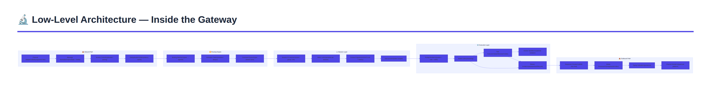
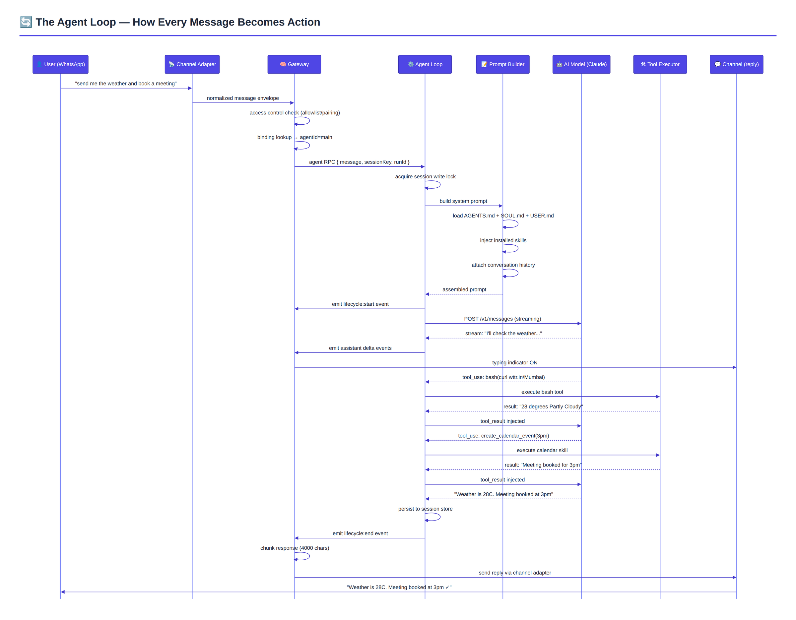
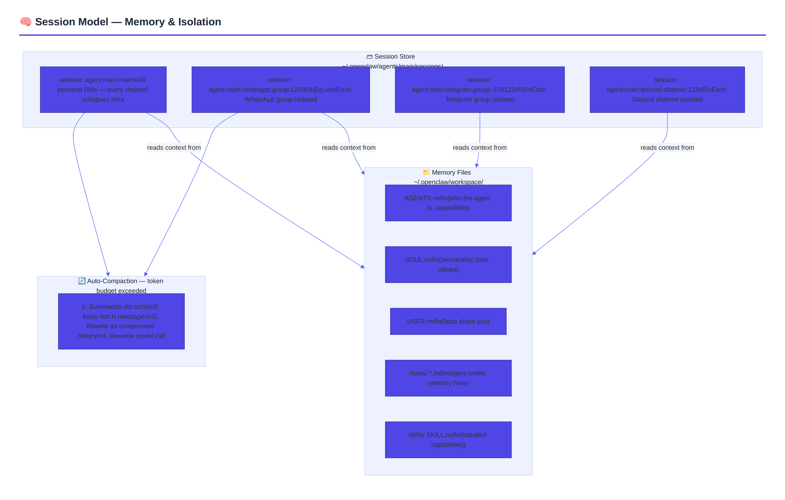
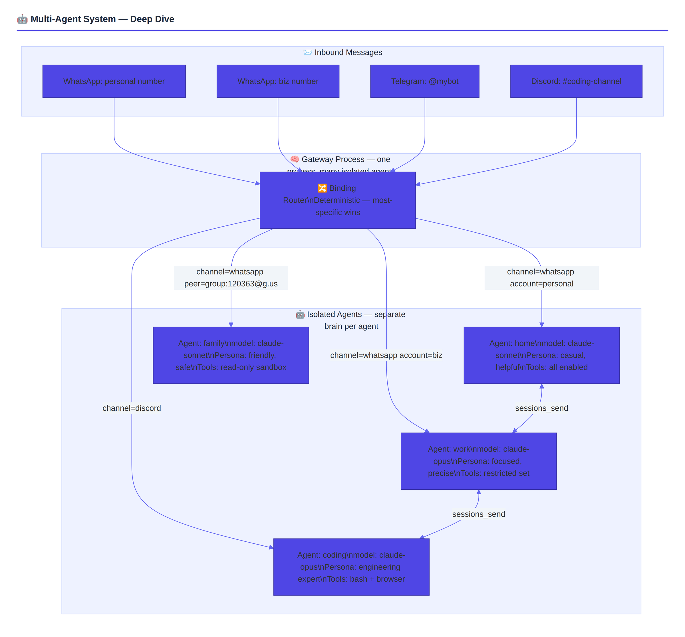
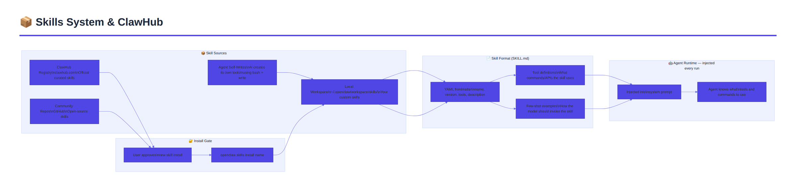
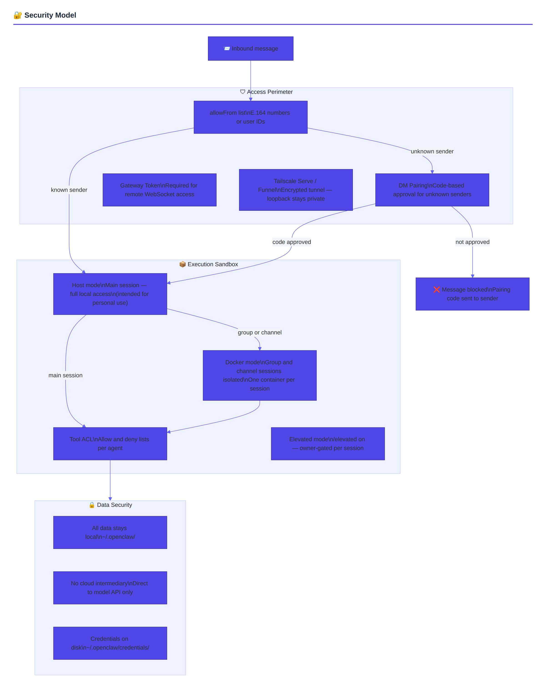
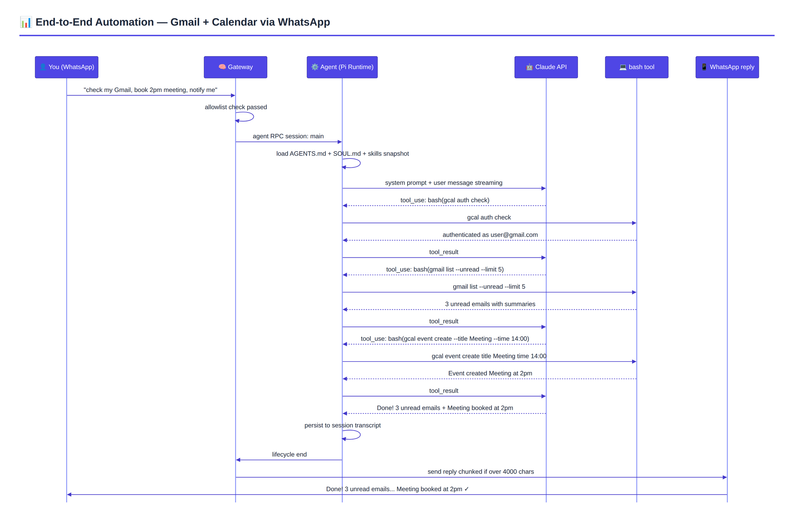
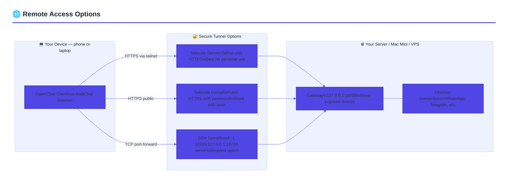

# 🦞 OpenClaw — Deep Dive Architecture & Complete Guide

> *Your own personal AI assistant. Any OS. Any Platform. The lobster way.*

[](https://github.com/openclaw/openclaw)
[](https://github.com/openclaw/openclaw/blob/main/LICENSE)
[](https://nodejs.org)

---

## 📋 Table of Contents

- [What Is OpenClaw?](#-what-is-openclaw)
- [The Big Idea — No Bot Accounts Needed (Most Channels)](#-the-big-idea--no-bot-accounts-needed-most-channels)
- [Channel Account Requirements — Exactly What You Need](#-channel-account-requirements--exactly-what-you-need)
- [High-Level Architecture](#-high-level-architecture)
- [Low-Level Architecture — Inside the Gateway](#-low-level-architecture--inside-the-gateway)
- [The Agent Loop — How Every Message Becomes Action](#-the-agent-loop--how-every-message-becomes-action)
- [Session Model — Memory & Isolation](#-session-model--memory--isolation)
- [Multi-Agent System — Deep Dive](#-multi-agent-system--deep-dive)
- [Automation Tools — Everything You Can Automate](#-automation-tools--everything-you-can-automate)
- [Skills System & ClawHub](#-skills-system--clawhub)
- [Security Model](#-security-model)
- [Installation & Setup](#-installation--setup)
- [Configuration Reference](#-configuration-reference)

---

## 🦞 What Is OpenClaw?

OpenClaw is a **self-hosted, local-first AI agent** that runs on your own machine (laptop, VPS, Mac Mini, Raspberry Pi) and connects your AI brain to every messaging app you already use. Think of it as a personal Jarvis — always running in the background, accessible from your pocket via WhatsApp, Telegram, Discord, iMessage, or 20+ other platforms.

Key characteristics:
- **Local-first**: your data, conversations, and memory live as plain Markdown files on your disk
- **Model-agnostic**: Claude, GPT-4, Gemini, Mistral — swap models freely
- **Self-hackable**: the agent can write and install its own skills to extend itself
- **Always-on**: a daemon runs 24/7, responding to messages and running scheduled tasks
- **No cloud intermediary**: messages travel → your machine → AI API → back. That's it.

---

## 🔑 The Big Idea — No Bot Accounts Needed (Most Channels)

This is the most important thing to understand. OpenClaw works **differently** for each channel:

| Channel | What you need | How it connects |
|---------|--------------|-----------------|
| **WhatsApp** | Your **own phone number** (or a dedicated SIM) | Scans a QR code via WhatsApp Web — links your number like a new device |
| **Telegram** | Create a **Bot via BotFather** (free, 30 seconds) | Official Telegram Bot API |
| **Discord** | Create a **Bot Application** (free Discord dev portal) | discord.js via Bot Token |
| **Slack** | Create a **Slack App** (free for personal workspaces) | Bolt SDK via Bot + App tokens |
| **Signal** | Your **own phone number** + `signal-cli` installed | signal-cli daemon on your machine |
| **iMessage / BlueBubbles** | Your **existing Apple ID** + BlueBubbles server running on macOS | BlueBubbles webhook bridge |
| **Google Chat** | Google Cloud project + Chat API enabled | Google Chat API |
| **IRC** | Any IRC nick (no registration required) | Direct IRC connection |
| **Microsoft Teams** | Teams app + Bot Framework registration | Azure Bot Framework |
| **WebChat** | Nothing — built-in | Served at `http://localhost:18789` |

### WhatsApp in Detail

WhatsApp uses the **Baileys** library — a WhatsApp Web reverse-engineered client. You scan a QR code once, and OpenClaw becomes a "linked device" on that phone number. **No special bot number is required** — your personal number works. However, the recommended setup is a **dedicated SIM / eSIM** (e.g. Tello, Google Voice) to keep things clean.

```bash
# Link your WhatsApp account
openclaw channels login --channel whatsapp

# A QR code appears in your terminal — scan it with WhatsApp
# (WhatsApp > Settings > Linked Devices > Link a Device)
```

---

## 📡 Channel Account Requirements — Exactly What You Need

### Telegram (Easiest — Start Here)
```
1. Message @BotFather on Telegram
2. Send /newbot
3. Choose a name and username
4. Copy the token that looks like: 123456789:ABCDefGhIJKlmNoPQRsTUVwxyZ
```

```json
{
  "channels": {
    "telegram": {
      "botToken": "123456789:ABCDefGhIJKlmNoPQRsTUVwxyZ"
    }
  }
}
```

### Discord
```
1. Go to discord.com/developers/applications
2. New Application → Bot → Add Bot
3. Enable "Message Content Intent" under Privileged Gateway Intents
4. Copy Bot Token
5. Invite bot to your server with bot + applications.commands scopes
```

### Slack
```
1. api.slack.com/apps → Create New App
2. Enable Socket Mode → Generate App-Level Token (connections:write)
3. OAuth & Permissions → Add bot scopes: app_mentions:read, chat:write, im:history, im:read
4. Install to workspace → Copy Bot Token and App Token
```

---

## 🏗 High-Level Architecture

This diagram shows how OpenClaw fits together from 30,000 feet:

## Architecture



---

## 🔬 Low-Level Architecture — Inside the Gateway



### Wire Protocol Details

Every client, node, and automation talks to the Gateway over **WebSocket** using JSON frames:

```
Transport:   WebSocket (text frames, JSON payloads)
Default:     ws://127.0.0.1:18789
Auth:        OPENCLAW_GATEWAY_TOKEN (optional, required for remote)

Frame types:
  connect   → { type: "connect", params: { auth, deviceId, role } }
  request   → { type: "req", id: "uuid", method: "agent", params: {...} }
  response  → { type: "res", id: "uuid", ok: true, payload: {...} }
  event     → { type: "event", event: "agent", payload: {...}, seq: 42 }

RPC methods:
  agent          - run an agent turn
  agent.wait     - wait for a run to complete
  send           - send a message to a channel
  sessions.*     - session management
  health         - gateway health check
  node.invoke    - invoke a device-node action
  node.list      - list connected nodes
```

---

## 🔄 The Agent Loop — How Every Message Becomes Action

This is the core execution path from message received to reply delivered:



### The Loop in Code Terms

```
agent RPC received
  ↓
validateParams() + resolveSession()
  ↓
agentCommand()
  ├── resolveModel() + loadSkillsSnapshot()
  └── runEmbeddedPiAgent()
        ↓
        serializeViaSessionQueue()   ← prevents concurrent session writes
          ↓
          buildPiSession()
            ├── resolveAuthProfile()
            ├── loadWorkspace()
            └── injectBootstrapFiles()
          ↓
          subscribeEmbeddedPiSession()
            ├── tool events    → stream: "tool"
            ├── assistant text → stream: "assistant"
            └── lifecycle      → stream: "lifecycle"
          ↓
          model API call (streaming)
          ↓
          for each tool_use block:
            ├── before_tool_call hook
            ├── execute tool (bash / browser / canvas / node.invoke / ...)
            ├── after_tool_call hook
            └── inject tool_result back into message stream
          ↓
          assemble final payload
          ↓
          persist session transcript
          ↓
          emit lifecycle:end
```

---

## 🧠 Session Model — Memory & Isolation



Key behaviors:
- **`main` session** — all your personal DMs from every channel collapse here by default, giving the agent persistent memory across WhatsApp, Telegram, Discord etc.
- **Group sessions** — each group chat gets its own isolated session so group conversations don't pollute your personal context
- **Memory files** — the agent can write to `~/.openclaw/workspace/` at any time. Notes persist across sessions. The agent literally builds a second brain for you.
- **Auto-compaction** — when session history grows too long, the agent summarizes old turns into a compressed context block

---

## 🤖 Multi-Agent System — Deep Dive

OpenClaw supports running **multiple completely isolated AI agents** inside one Gateway process. Each agent is a separate brain with its own workspace, personality, model, auth, and session store.



### Binding Resolution Order (Most Specific Wins)

```
1. exact peer match    (specific DM/group JID)
2. parentPeer match    (thread in that group)
3. guildId + roles     (Discord role-based routing)
4. guildId             (Discord server)
5. teamId              (Slack workspace)
6. accountId           (specific phone/bot account)
7. channel wildcard    (accountId: "*")
8. default agent       (agents.list[].default, or first entry)
```

### Agent-to-Agent Communication

Agents can pass messages to each other using session tools:

```
sessions_list        → discover all active agents + their metadata
sessions_history     → fetch another agent's conversation transcript
sessions_send        → send a message to another agent (with optional reply-back ping-pong)
sessions_spawn       → spawn a sub-agent for a subtask
```

This enables **orchestrator-worker patterns**: your main agent can delegate a deep research task to a `coding` agent, receive the result, and summarize it back to you.

### Config Example — Two Agents, Two WhatsApp Numbers

```json5
{
  agents: {
    list: [
      {
        id: "personal",
        workspace: "~/.openclaw/workspace-personal",
        model: "anthropic/claude-sonnet-4-6",
      },
      {
        id: "work",
        workspace: "~/.openclaw/workspace-work",
        model: "anthropic/claude-opus-4-6",
        sandbox: { mode: "all" },
        tools: {
          deny: ["browser", "canvas"],
          allow: ["read", "bash", "sessions_list"],
        },
      },
    ],
  },

  bindings: [
    { agentId: "personal", match: { channel: "whatsapp", accountId: "personal" } },
    { agentId: "work",     match: { channel: "whatsapp", accountId: "biz" } },
    { agentId: "work",     match: { channel: "telegram" } },
  ],

  channels: {
    whatsapp: {
      accounts: {
        personal: {},
        biz: {},
      },
    },
  },
}
```

---

## ⚙️ Automation Tools — Everything You Can Automate Locally

OpenClaw's agent can use these tools to act on your behalf on your local machine and services:

### 1. 🖥 Bash / Shell Execution

The most powerful tool. The agent runs **any shell command** on your machine.

```
What you can do:
  - Read/write files anywhere on your filesystem
  - Run Python/Node/Ruby scripts
  - Call CLIs (git, docker, kubectl, ffmpeg, etc.)
  - Pipe commands together
  - Run background processes

Example prompts:
  "Find all PDFs in my Downloads folder from last week"
  "Compress all images in ~/Photos to 80% quality"
  "Run the test suite and tell me which tests failed"
  "Check my disk usage and delete node_modules folders over 500MB"
  "Pull the latest from git, run tests, and deploy if green"
```

Security note: by default, bash runs on your host with your user permissions. For untrusted agents (groups), enable Docker sandboxing.

### 2. 🌐 Browser Automation (Chrome CDP)

OpenClaw manages its own dedicated Chrome/Chromium instance via **Chrome DevTools Protocol**.

```
What you can do:
  - Navigate to any URL
  - Click buttons, fill forms, submit data
  - Take screenshots
  - Extract text/data from pages
  - Log into websites (saves session profiles)
  - Download files
  - Automate any web-based task

Example prompts:
  "Check in for my Air India flight tomorrow"
  "Go to my bank, download last month's statement, categorize the expenses"
  "Search for the cheapest flight from Mumbai to Delhi next Friday"
  "Log into my GitHub and review open PRs in my repos"
  "Fill out the Google Form at this URL with my details: ..."
```

Config:
```json
{
  "browser": {
    "enabled": true,
    "color": "#FF4500"
  }
}
```

### 3. 🎨 Canvas + A2UI (Live Visual Workspace)

The agent can render and control a **live HTML/CSS/JS visual workspace** that you view in a browser or companion app.

```
What you can do:
  - Agent pushes a live dashboard that updates in real-time
  - Render charts, tables, custom UIs
  - Interactive elements the agent controls
  - Persistent visual state across sessions

Example: Agent builds a live task board that updates as it processes your backlog
```

### 4. ⏰ Cron Jobs & Scheduled Tasks

Define scheduled tasks that fire without any user prompt.

```json5
{
  cron: [
    {
      id: "morning-brief",
      schedule: "0 7 * * *",        // Every day at 7am
      agent: "personal",
      message: "Give me a morning briefing: weather, my calendar, and top 3 things to do today",
      channel: "whatsapp",
    },
    {
      id: "weekly-review",
      schedule: "0 18 * * 5",       // Every Friday at 6pm
      agent: "work",
      message: "Summarize what I accomplished this week from my workspace notes",
      channel: "telegram",
    },
    {
      id: "git-sync",
      schedule: "*/30 * * * *",     // Every 30 minutes
      agent: "coding",
      message: "Check for new commits in ~/projects/myapp and summarize changes",
    },
  ]
}
```

### 5. 🪝 Webhooks (External Triggers)

OpenClaw can receive HTTP webhooks and trigger agent runs.

```
Webhook URL: http://localhost:18789/__openclaw__/webhook/<id>

Use cases:
  - GitHub webhook → agent reviews every new PR
  - Stripe webhook → agent notifies you of payments
  - Zapier/Make → connect 5000+ services to your agent
  - CI/CD pipeline → agent posts build results to Telegram
  - Home automation → smart home events trigger agent responses
```

Config:
```json5
{
  webhooks: [
    {
      id: "github-pr",
      path: "/hooks/github",
      secret: "my-secret",
      agent: "coding",
      messageTemplate: "New PR in {{repo}}: {{title}} by {{author}}. Review it.",
    }
  ]
}
```

### 6. 📧 Gmail Pub/Sub (Email Automation)

Real-time email triggers via Google Cloud Pub/Sub.

```
What you can do:
  - Trigger agent when new email arrives
  - Auto-triage inbox
  - Draft and send replies
  - Forward summaries to WhatsApp
  - Auto-archive newsletters

Example: "When a new email from my bank arrives, extract the transaction and add it to my expense tracker"
```

### 7. 📱 Device Nodes (iOS / Android / macOS)

Mobile apps that pair as **nodes** and expose device capabilities to the agent:

```
Android node capabilities:
  - Send SMS
  - Read/send notifications
  - Get current location (GPS)
  - Access contacts
  - Read calendar
  - Camera snapshot
  - Screen recording
  - App updates

macOS node capabilities:
  - system.run (run commands with native macOS permissions)
  - system.notify (post system notifications)
  - camera snapshot
  - screen recording
  - location.get

iOS node capabilities:
  - Voice Wake (wake word detection)
  - Talk Mode (continuous voice)
  - Canvas surface
  - Camera
  - Screen recording
```

The agent calls these via `node.invoke`:
```
"Take a photo with my phone camera and tell me what you see"
"What's my current location?"
"Send an SMS to +91-XXXXX saying I'll be late"
"Post a macOS notification reminding me to drink water"
```

---

## 📦 Skills System & ClawHub

Skills are **modular, portable capability packs** that extend what your agent can do.



### Installing a Skill

```bash
# From ClawHub
openclaw skills install calendar

# The agent can also install skills itself:
# "Install the GitHub skill from ClawHub"
# Agent runs: openclaw skills install github
```

### Skill File Structure

```markdown
---
name: calendar
version: 1.0.0
tools:
  - bash
description: Manage Google Calendar via gcal CLI
---

# Calendar Skill

You can manage the user's Google Calendar using the `gcal` CLI.

## Creating events
Use `gcal event create --title "..." --start "..." --duration 60`

## Listing events
Use `gcal events --today` for today's schedule
```

Skills encode domain knowledge into the system prompt, teaching the agent which commands to run and how to interpret their output for specific tasks.

---

## 🔐 Security Model



### Default Security Posture

```
Main session (your personal DMs):
  → tools run on host with your user permissions
  → agent has full shell access (this is intentional — it's just you)

Group / non-main sessions:
  → sandbox.mode: "non-main" runs bash in Docker per session
  → tools allowlist: bash, process, read, write, edit, sessions_*
  → tools denylist: browser, canvas, nodes, cron, discord, gateway

DM policy (all channels):
  → default: "pairing" — unknown senders get a code, bot ignores them
  → approve with: openclaw pairing approve <channel> <code>
  → never use "open" + "*" in allowFrom unless you know the risks
```

---

## 🚀 Installation & Setup

### Prerequisites

```bash
node --version   # Must be 22.16+ (Node 24 recommended)
```

### Install

```bash
# Global install via npm
npm install -g openclaw@latest

# Or pnpm
pnpm add -g openclaw@latest
```

### Guided Setup (Recommended)

```bash
openclaw onboard --install-daemon
```

This interactive wizard:
1. Authenticates your AI model (Claude, GPT, etc.)
2. Configures the Gateway daemon (launchd on macOS, systemd on Linux)
3. Sets up your first channel (Telegram recommended for beginners)
4. Installs your first skills
5. Starts a test conversation

### Manual Gateway Start

```bash
# Foreground (verbose logs)
openclaw gateway --port 18789 --verbose

# Background daemon
openclaw gateway start

# Health check
openclaw doctor
```

### Connecting WhatsApp

```bash
# Install the WhatsApp plugin
openclaw plugins install @openclaw/whatsapp

# Link your account (scan QR)
openclaw channels login --channel whatsapp

# For a dedicated second number
openclaw channels login --channel whatsapp --account biz
```

---

## 📝 Configuration Reference

Config lives at `~/.openclaw/openclaw.json` (JSON5 format — comments allowed).

```json5
{
  // ── Model ────────────────────────────────────────────────────────────────
  agent: {
    model: "anthropic/claude-sonnet-4-6",  // default model for all agents
  },

  // ── Channels ─────────────────────────────────────────────────────────────
  channels: {
    whatsapp: {
      dmPolicy: "pairing",           // pairing | allowlist | open | disabled
      allowFrom: ["+919876543210"],  // E.164 phone numbers
      groupPolicy: "allowlist",
      ackReaction: { emoji: "👀", direct: true, group: "mentions" },
    },
    telegram: {
      botToken: "123456:ABC...",
      dmPolicy: "pairing",
    },
    discord: {
      token: "DISCORD_BOT_TOKEN",
    },
  },

  // ── Multi-agent ───────────────────────────────────────────────────────────
  agents: {
    list: [
      {
        id: "main",
        default: true,
        workspace: "~/.openclaw/workspace",
        model: "anthropic/claude-sonnet-4-6",
      },
    ],
  },

  bindings: [
    // Route specific number to a specific agent
    { agentId: "main", match: { channel: "whatsapp", accountId: "personal" } },
  ],

  // ── Automation ────────────────────────────────────────────────────────────
  cron: [
    {
      id: "morning",
      schedule: "0 7 * * *",
      message: "Morning briefing please",
      channel: "whatsapp",
    },
  ],

  // ── Browser ───────────────────────────────────────────────────────────────
  browser: {
    enabled: true,
  },

  // ── Security ──────────────────────────────────────────────────────────────
  gateway: {
    bind: "loopback",         // never expose directly — use Tailscale or SSH tunnel
    auth: {
      mode: "token",
    },
    tailscale: {
      mode: "serve",           // off | serve | funnel
    },
  },

  // ── Sandbox ───────────────────────────────────────────────────────────────
  agents: {
    defaults: {
      sandbox: {
        mode: "non-main",    // sandbox group/channel sessions in Docker
      },
    },
  },
}
```

---

## 📊 How a Complete End-to-End Automation Works

Here is what actually happens when you send *"check my Gmail, book a 2pm meeting, then notify me on WhatsApp"*:



---

## 🌐 Remote Access Options

Running OpenClaw on a server? Three secure options:



```bash
# SSH tunnel (simplest)
ssh -N -L 18789:127.0.0.1:18789 user@your-server

# Then connect to ws://127.0.0.1:18789 locally

# Tailscale (recommended for permanent setup)
# Set in config:
# gateway.tailscale.mode = "serve"
```

---

*Built by [@steipete](https://x.com/steipete) and the OpenClaw community. MIT licensed.*
*Docs: [docs.openclaw.ai](https://docs.openclaw.ai) · Discord: [discord.gg/clawd](https://discord.gg/clawd)*