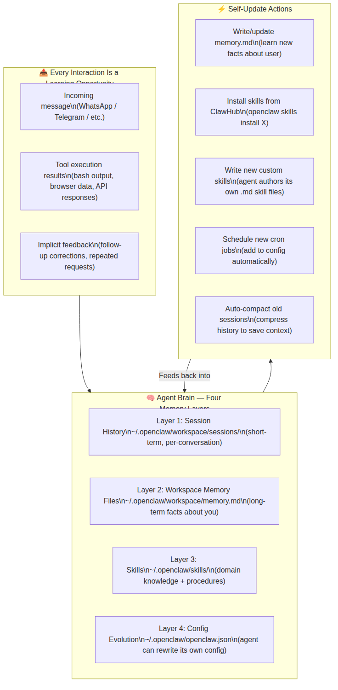
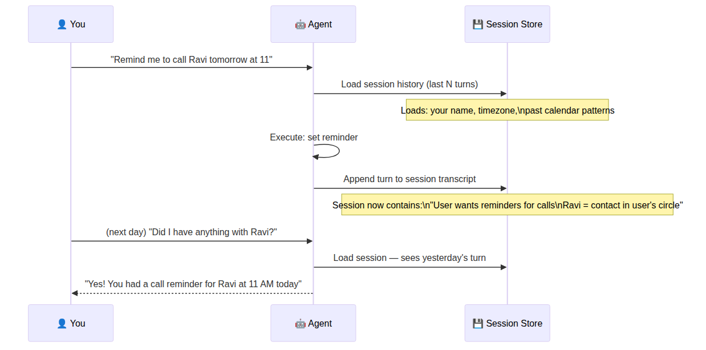
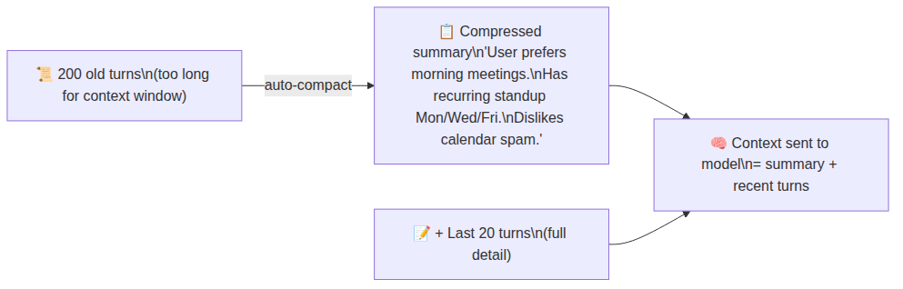
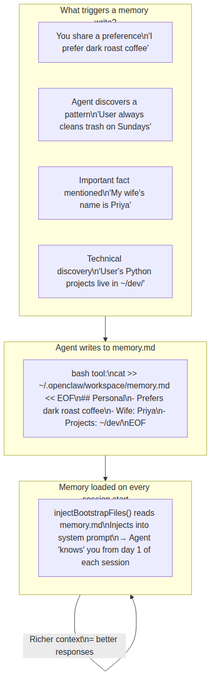
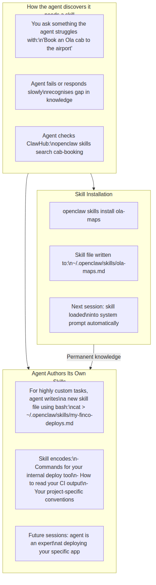
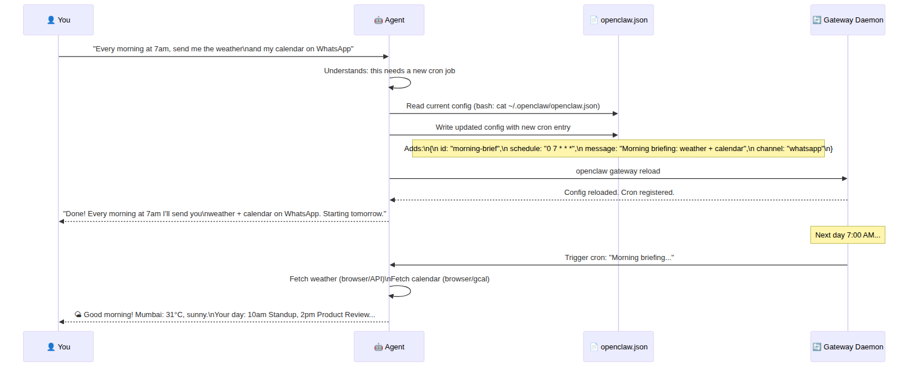
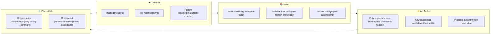
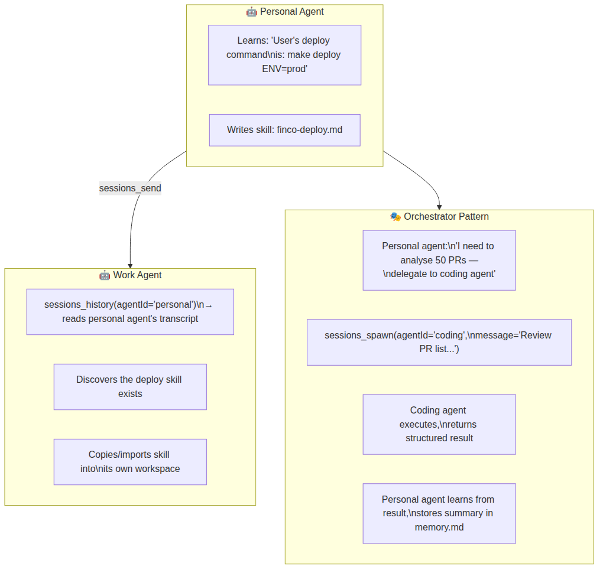
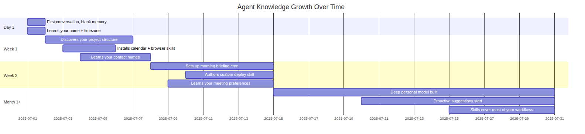
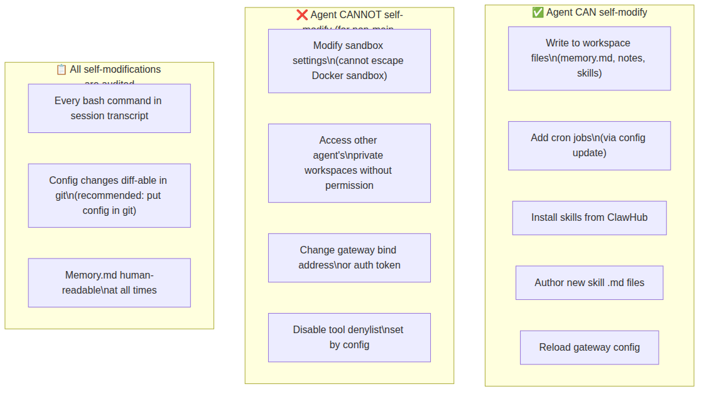

# 🧠 OpenClaw — How Agents Learn & Update Themselves
> *The self-improving AI that gets smarter the more you use it*

OpenClaw agents are not static chatbots. They maintain persistent memory, can install new skills, rewrite their own configuration, and improve their behaviour over time — all without you doing anything. This document explains every learning and self-update mechanism in detail.

---

## 🗺️ The Learning Architecture — Overview



---

## 🗂️ Layer 1 — Session History (Short-Term Memory)

Each conversation is stored as a running transcript. This is the agent's **working memory** during a session.



**Where it lives:** `~/.openclaw/workspace/sessions/<session-id>.md`

**Auto-compaction:** When the session grows beyond the model's context window, the agent automatically summarises old turns into a compressed block:



---

## 🗂️ Layer 2 — Workspace Memory Files (Long-Term Facts)

The agent can write to any file in your workspace at any time using bash. The most important is `memory.md` — a structured file where the agent stores **persistent facts about you**.



**Example memory.md that builds over time:**

```markdown
# User Memory — Updated 2025-07-14

## Personal
- Name: Arjun
- Location: Mumbai, India (IST = UTC+5:30)
- Wife: Priya | Son: Vihaan (age 7)

## Work
- Role: Product Manager at FinCo
- Key contacts: Ravi (CTO), Neha (Design), Sam (Engineering)
- Standup: Mon/Wed/Fri 10am
- Projects dir: ~/dev/finco/

## Preferences
- Meeting length: 30 min default, 1hr for external
- Prefers WhatsApp for quick things, email for formal
- Trash cleanup: monthly (last: 3.2GB on 2025-07-14)

## Patterns Observed
- Asks for morning briefings when traveling
- Delegates research tasks on Monday mornings
- Frequently needs PDF → summary for long docs
```

---

## 🗂️ Layer 3 — Skills: Domain Knowledge the Agent Installs

Skills are markdown files that teach the agent **how to perform specific domain tasks** — which commands to run, how to interpret output, what edge cases exist.



**Skill file anatomy (what the agent writes/reads):**

```markdown
---
name: google-calendar
version: 1.2.0
tools:
  - browser
description: Manage Google Calendar
---

# Google Calendar Skill

## Creating events
Navigate to calendar.google.com, click "+ Create".
Fill: Title, Start time (always check user timezone = IST),
Duration (default 30 min unless specified).
Click Save and confirm the event appeared.

## Checking schedule
Use `gcal events --today` if gcal CLI is installed.
Otherwise scrape the calendar page and return a structured list.

## Common errors
- "Sign in required" → use browser login profile "google-personal"
- Duplicate event warning → check if event already exists first
```

---

## 🗂️ Layer 4 — Config Evolution (Agent Rewrites Its Own Config)

The most powerful self-update: the agent can **modify its own `openclaw.json`** to add cron jobs, webhooks, new bindings, or change its own model.



---

## 🔄 The Full Learning Cycle



---

## 🤖 Multi-Agent Learning: Agents Teaching Each Other

When you run multiple agents (e.g. `personal` + `work`), they can share knowledge:



---

## 📈 Learning Timeline — What Happens Over Days/Weeks



---

## 🔐 What the Agent Cannot Self-Modify

Learning is powerful but **guarded by the security model**:



---

## 💡 Summary: The Three Self-Improvement Loops

| Loop | Trigger | Mechanism | Timescale |
|------|---------|-----------|-----------|
| **Memory** | Any conversation | Writes facts to memory.md | Immediate |
| **Skills** | New domain task | Installs or authors skill files | Per need |
| **Automation** | Repeated manual task | Adds cron job / webhook to config | When asked |

The more you use OpenClaw, the less you have to explain — it builds a persistent mental model of your life, work, and preferences, and acts on your behalf with increasing accuracy.