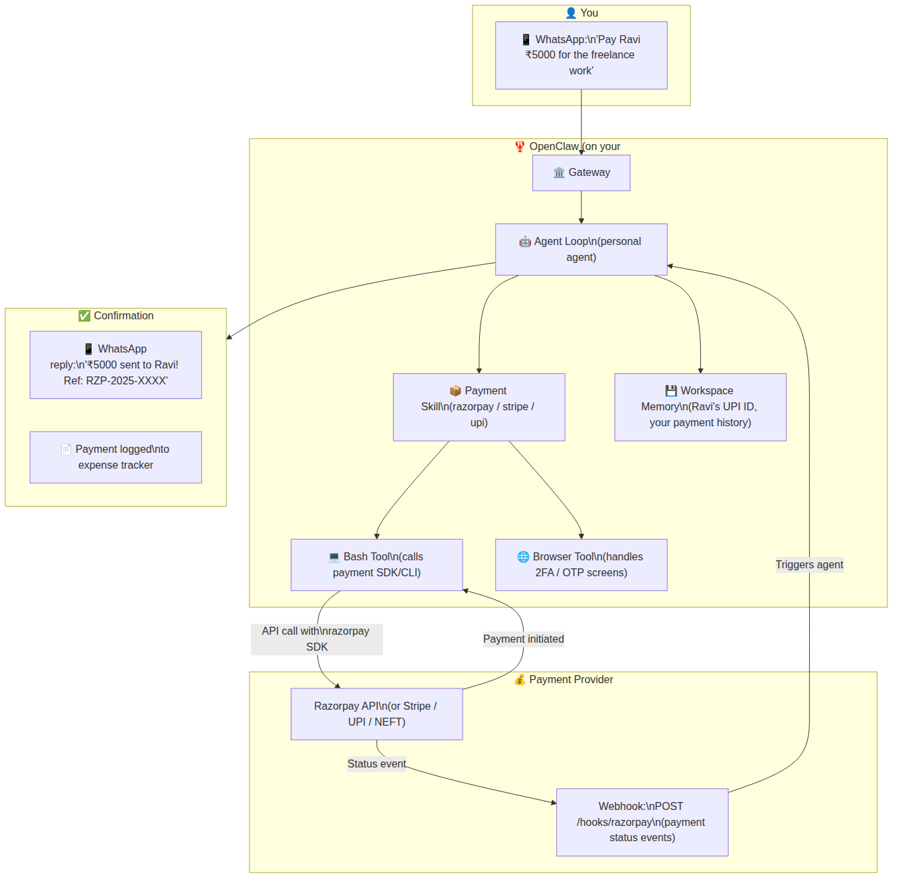
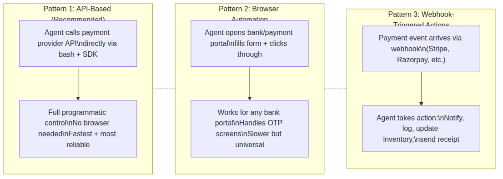
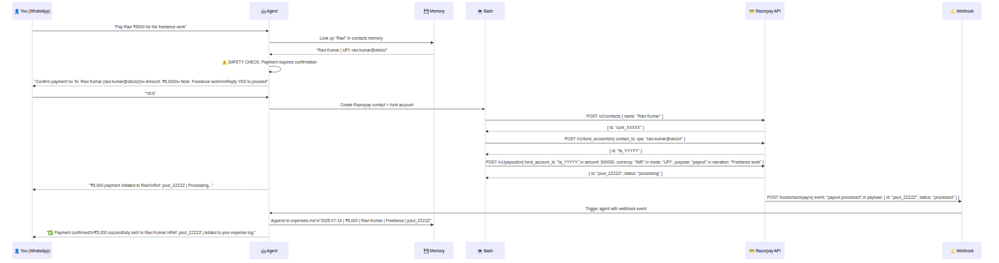
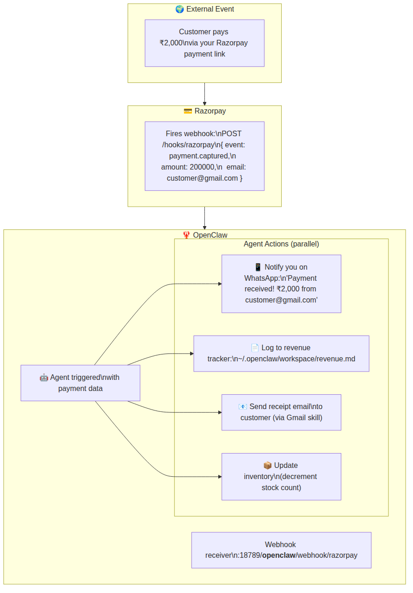
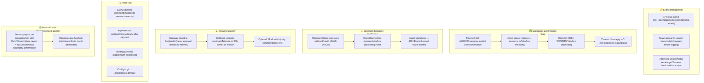
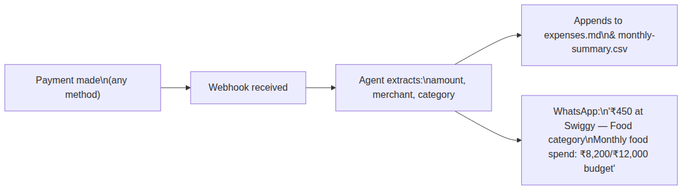
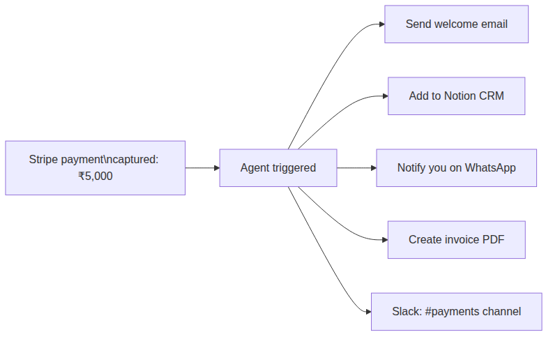
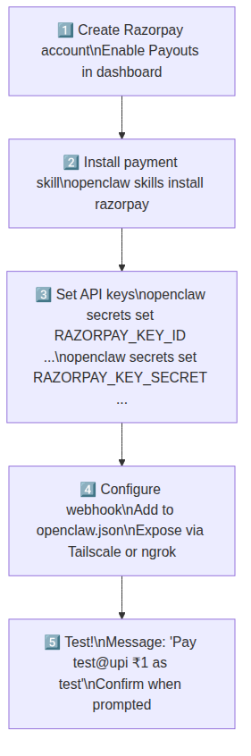

# 💳 OpenClaw — Payments Integration Guide
> *Can OpenClaw do payments? Yes — here's exactly how, end-to-end*

OpenClaw does **not** have built-in payment processing. However, because it has full browser automation, bash access, webhook ingestion, and a skills system, it can act as a **payment orchestration layer** on top of real payment providers. This document covers the full architecture, security model, and a complete worked example.

---

## ⚠️ Important Disclaimer

> OpenClaw is an AI agent framework. It does not hold, transmit, or settle money itself. Actual payment processing is handled by regulated third-party providers (Razorpay, Stripe, UPI, etc.). OpenClaw sits **above** these systems, orchestrating them via their APIs, webhooks, and SDKs — the same way a developer would, but triggered by natural language.

---

## 🗺️ High-Level Architecture



---

## 🔬 The Three Payment Patterns

OpenClaw supports three distinct patterns for payments, depending on your use case:



---

## 📋 Complete Worked Example — UPI Payment via Razorpay

**Your message:** `"Pay Ravi ₹5000 for the freelance work"`

### Step 1 — Setup: Payment Skill Installation

```bash
# Install the payment skill
openclaw skills install razorpay

# Set your API keys (stored encrypted in ~/.openclaw/secrets/)
openclaw secrets set RAZORPAY_KEY_ID rzp_live_XXXXXXXX
openclaw secrets set RAZORPAY_KEY_SECRET your_secret_here
```

The skill file teaches the agent everything it needs:

```markdown
---
name: razorpay
version: 1.0.0
tools:
  - bash
description: Send and receive payments via Razorpay API (India)
---

# Razorpay Payment Skill

## Sending a UPI payment (payout)
Use the Razorpay Payouts API. Steps:
1. Resolve recipient's VPA (UPI ID) from memory or ask user
2. Create a payout via: curl -X POST .../payouts with fund_account_id + amount
3. Confirm success by checking payout status

## Required: always confirm with user before executing
Before making any payment, state: recipient, amount, reference — and ask for explicit confirmation.

## Logging
After payment: append to ~/.openclaw/workspace/expenses.md with date, amount, recipient, reference ID
```

---

### Step 2 — Full Execution Sequence



---

### Step 3 — The Bash Commands That Actually Run

```bash
#!/bin/bash
# Razorpay Payout Script (generated by agent)

KEY_ID=$(openclaw secrets get RAZORPAY_KEY_ID)
KEY_SECRET=$(openclaw secrets get RAZORPAY_KEY_SECRET)
AUTH=$(echo -n "$KEY_ID:$KEY_SECRET" | base64)

# Step 1: Create contact
CONTACT=$(curl -s -X POST https://api.razorpay.com/v1/contacts \
  -H "Authorization: Basic $AUTH" \
  -H "Content-Type: application/json" \
  -d '{"name":"Ravi Kumar","type":"vendor"}')

CONTACT_ID=$(echo $CONTACT | jq -r '.id')

# Step 2: Create fund account (UPI)
FUND_ACCOUNT=$(curl -s -X POST https://api.razorpay.com/v1/fund_accounts \
  -H "Authorization: Basic $AUTH" \
  -H "Content-Type: application/json" \
  -d "{\"contact_id\":\"$CONTACT_ID\",\"account_type\":\"vpa\",\"vpa\":{\"address\":\"ravi.kumar@okicici\"}}")

FA_ID=$(echo $FUND_ACCOUNT | jq -r '.id')

# Step 3: Initiate payout
PAYOUT=$(curl -s -X POST https://api.razorpay.com/v1/payouts \
  -H "Authorization: Basic $AUTH" \
  -H "Content-Type: application/json" \
  -d "{\"account_number\":\"$ACCOUNT_NUMBER\",\"fund_account_id\":\"$FA_ID\",\"amount\":500000,\"currency\":\"INR\",\"mode\":\"UPI\",\"purpose\":\"payout\",\"narration\":\"Freelance work\"}")

echo $PAYOUT | jq '{id, status, amount, utr}'
```

---

## 🪝 Incoming Payments — Webhook Architecture

When you **receive** money, OpenClaw can take automated actions:



**Webhook config in `openclaw.json`:**

```json5
{
  webhooks: [
    {
      id: "razorpay-payments",
      path: "/hooks/razorpay",
      secret: "your-webhook-secret",    // Razorpay signs payloads with this
      agent: "personal",
      messageTemplate: "Payment event: {{event}} | Amount: {{payload.payment.entity.amount}} paise | From: {{payload.payment.entity.email}}. Take appropriate action."
    },
    {
      id: "stripe-events",
      path: "/hooks/stripe",
      secret: "whsec_XXXXXXXX",
      agent: "personal",
      messageTemplate: "Stripe event: {{type}} | {{data.object.amount}} {{data.object.currency}}"
    }
  ]
}
```

---

## 🔐 Security Architecture — Payments Require Extra Care



---

## 🏦 Supported Payment Providers

| Provider | Pattern | India Support | Notes |
|----------|---------|--------------|-------|
| **Razorpay** | API + Webhook | ✅ UPI, IMPS, NEFT | Best for India. Payouts API available. |
| **Stripe** | API + Webhook | ⚠️ Limited | Best for international. |
| **PayU** | API + Browser | ✅ UPI, Cards | API less clean; browser fallback needed. |
| **HDFC / ICICI NetBanking** | Browser only | ✅ | Full browser automation, handles OTP. |
| **Google Pay (UPI)** | Browser/App via node | ✅ | Via Android node (device automation). |
| **PhonePe / Paytm** | Browser + Webhook | ✅ | Webhook for merchant; browser for personal. |

---

## 💡 Advanced Use Cases

### 1. Automated Expense Tracking



### 2. Payment-Triggered Workflows



### 3. Conversational Payment History

```
You: "How much did I pay Ravi last month?"
Agent: (reads expenses.md)
→ "You paid Ravi ₹15,000 across 3 transactions in June:
   • ₹5,000 on June 3 (Freelance - UI design)
   • ₹5,000 on June 14 (Freelance - work)
   • ₹5,000 on June 28 (Freelance - backend)"
```

---

## ⚡ Quick Start — Payments in 5 Steps



---

## 🚫 What OpenClaw Should NOT Be Used For (Payments)

- **Do not** store card numbers, CVVs, or bank passwords in workspace files
- **Do not** use OpenClaw as a PCI-DSS compliant payment processor (it is not certified)
- **Do not** expose the gateway webhook endpoint without signature verification enabled
- **Do not** disable the confirmation gate for automated recurring payments unless you have strict amount limits and are very confident in your setup
- **Do not** run payment agents in group sessions (sandbox mode blocks payment tools by default — keep it that way)

---

## 📝 Summary

OpenClaw can orchestrate payments by acting as an intelligent layer above real payment APIs. The key components are:

**Outbound payments** → Bash tool + Razorpay/Stripe SDK + mandatory confirmation gate

**Inbound payment notifications** → Webhook receiver → agent triggered → WhatsApp notification + logging + downstream actions

**Security** → Secrets encrypted at rest + webhook signature verification + gateway on loopback + full audit trail in session transcripts

The result: you can say *"Pay Ravi ₹5000"* from WhatsApp and have it done — with confirmation, logging, and a receipt — in under 30 seconds.