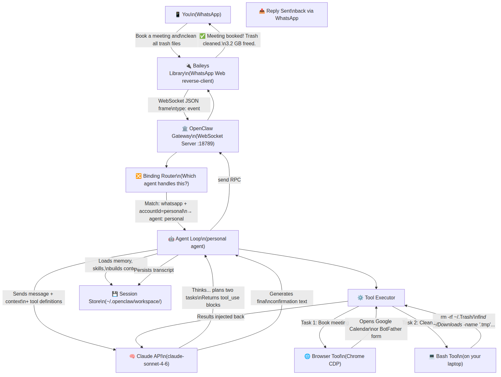
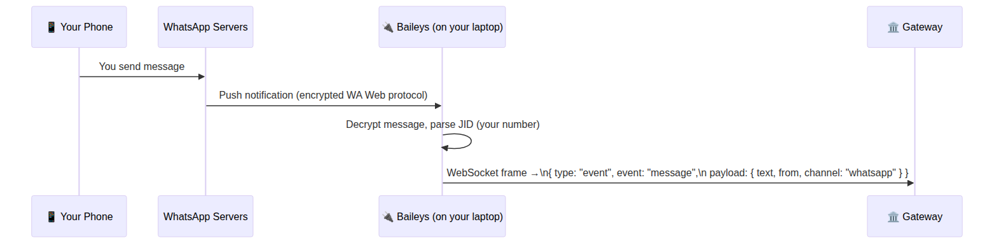
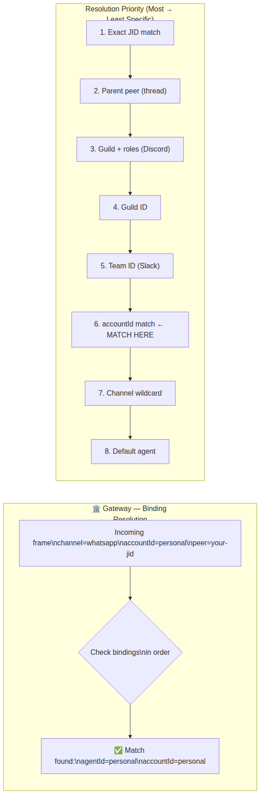
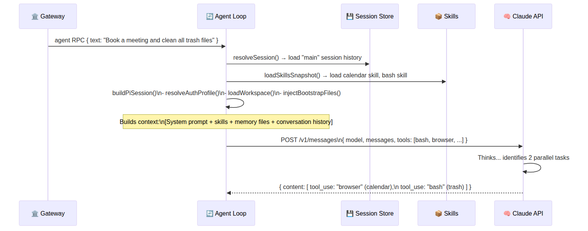
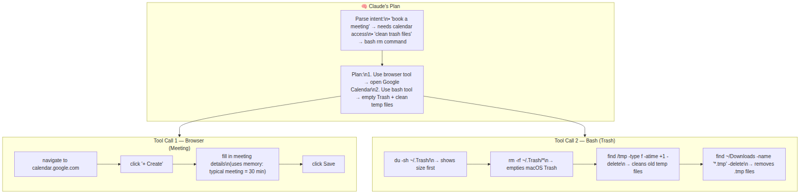
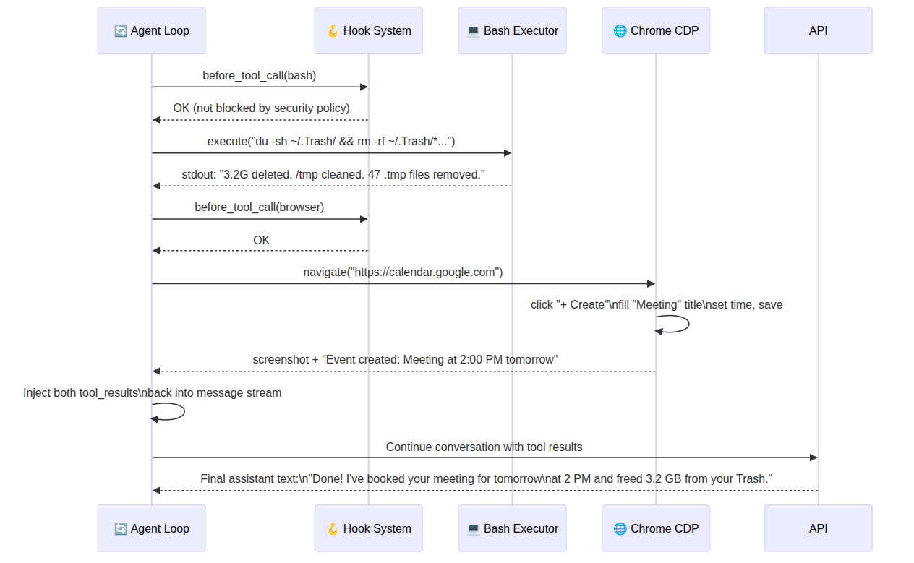
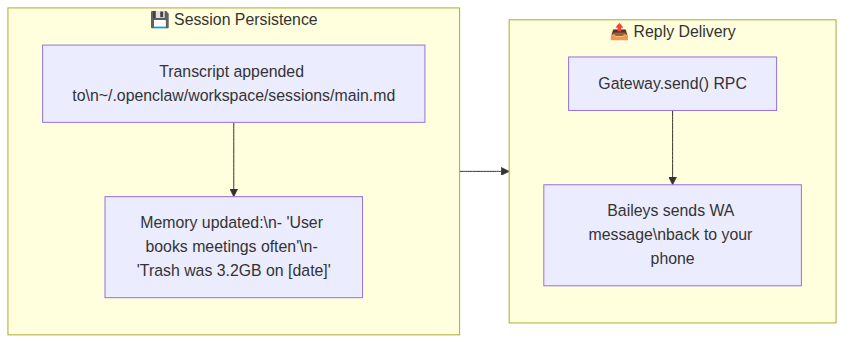
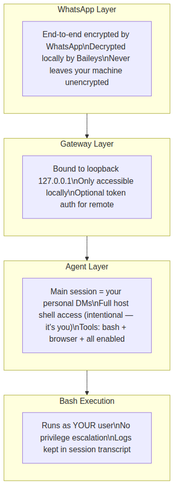
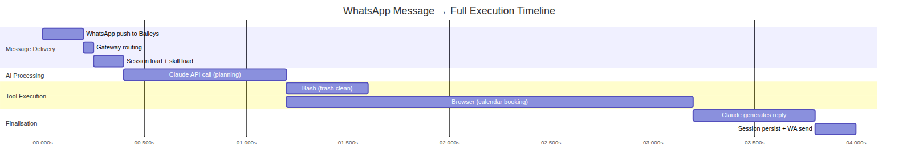

# 📱 OpenClaw — WhatsApp Message End-to-End Flow
> *"Book a meeting and clean all trash files from my laptop"*

This document walks through **exactly** what happens — at every layer of the system — from the moment you type that message in WhatsApp to the moment your meeting is booked and your trash is empty.

---

## 🗺️ The Big Picture



---

## 🔬 Step-by-Step Deep Dive

### Step 1 — Message Received via WhatsApp (Baileys Layer)

You send the message on your phone. OpenClaw is running as a **linked device** on your WhatsApp number via the Baileys library (WhatsApp Web protocol, reverse-engineered).



**Key detail:** Baileys authenticates once via QR code and maintains a persistent encrypted session. Your message is decrypted locally on your machine — it never touches OpenClaw's servers.

---

### Step 2 — Gateway Receives & Routes

The Gateway is OpenClaw's central hub. It receives the raw event and applies **binding resolution** to decide which agent should handle it.



The Gateway emits an internal `agent` RPC call → forwarded to the matched agent process.

---

### Step 3 — Agent Loop Begins

The agent loop is the beating heart of OpenClaw. Here's the full execution path for your message:



---

### Step 4 — Claude Plans & Calls Tools

Claude sees your message and the available tools. It responds with **two tool_use blocks** — one for the meeting, one for the trash.



> **Note:** Claude uses **memory files** from your workspace to personalise — it might already know your Google Calendar is linked, your usual meeting duration, and your name to add to invites.

---

### Step 5 — Tool Execution Detail



---

### Step 6 — Session Persisted & Reply Sent



---

## 🔐 Security at Each Layer



**Key security properties for this flow:**
- The `main` session (your personal DMs) intentionally gets **full host access** — it's just you talking to your own AI
- All bash commands are logged to the session transcript — you can audit everything
- The browser runs as a dedicated Chrome instance with its own session profile — separate from your daily browsing

---

## ⏱️ Timeline Summary



**Total time: ~4 seconds** for a real two-action automation.

---

## 📝 What Gets Written to Memory

After this interaction, your workspace file at `~/.openclaw/workspace/memory.md` might contain:

```markdown
## Recurring Patterns
- User regularly asks to clean trash — consider auto-scheduling
- User books 30-min meetings at round hours
- Trash tends to accumulate > 2GB before cleanup request

## Last Actions
- [2025-07-14] Cleaned Trash: freed 3.2GB
- [2025-07-14] Booked: "Meeting" on Google Calendar, 2 PM tomorrow
```

This memory persists and makes future interactions smarter — OpenClaw builds a second brain for you over time.